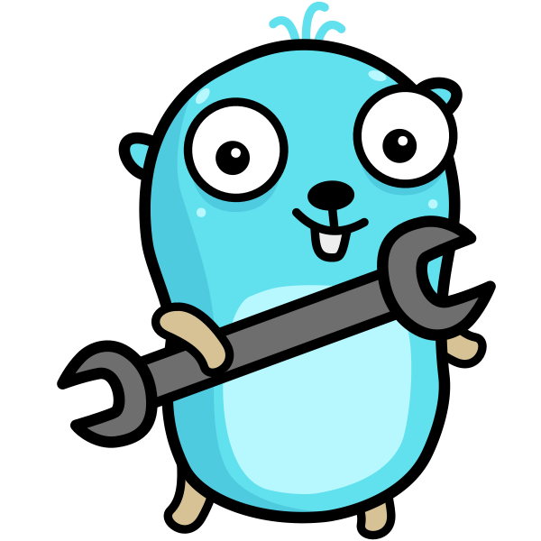

<h1 align="center">
<br/>
GLI
</h1>
<p align="center">Generate boilerplate code for your next Go project</p>

<p align="center">
<a href="https://pkg.go.dev/github.com/mehditeymorian/gli/v3?tab=doc"target="_blank">
    
</a>&nbsp;


</p>

# Installation
```shell
go get github.com/mehditeymorian/gli
```

# Create New Project
Use command `gli create` for generating new project
```text
➜  gli-playground gli create
? App Name? app
? Go Version 1.18
? choose module you need db, http, logger
? choose technology for db mongo
? choose technology for http gofiber
? choose technology for logger zap
? Do you want a cli app? No
? Do you want to create a Dockerfile? No
██████████ Downloading Template ██████████
✅	Module gofiber Downloaded
✅	Module mongo Downloaded
✅	Module zap Downloaded
✅	Module Simple Downloaded
✅	Module config Downloaded
✅	Module Others Downloaded
██████████ Downloading Packages ██████████
✅	Got github.com/gofiber/fiber/v2
✅	Got go.mongodb.org/mongo-driver/mongo
✅	Got go.uber.org/zap@latest
✅	Got github.com/knadh/koanf@latest
✅	Got github.com/tidwall/pretty@latest
voilà, Done 🤌🏻
██████████████████████████████████████████


  __ _  _ __   _ __
 / _` || '_ \ | '_ \
| (_| || |_) || |_) |
 \__,_|| .__/ | .__/
       | |    | |
       |_|    |_|

📝 Summary
🔥 6/6 Template Downloaded
🔥 5/5 Package Downloaded

app is Ready! 😎🙌
```

# License
Unless otherwise noted, the GLI source files are distributed under the Apache Version 2.0 license found in the LICENSE file.
